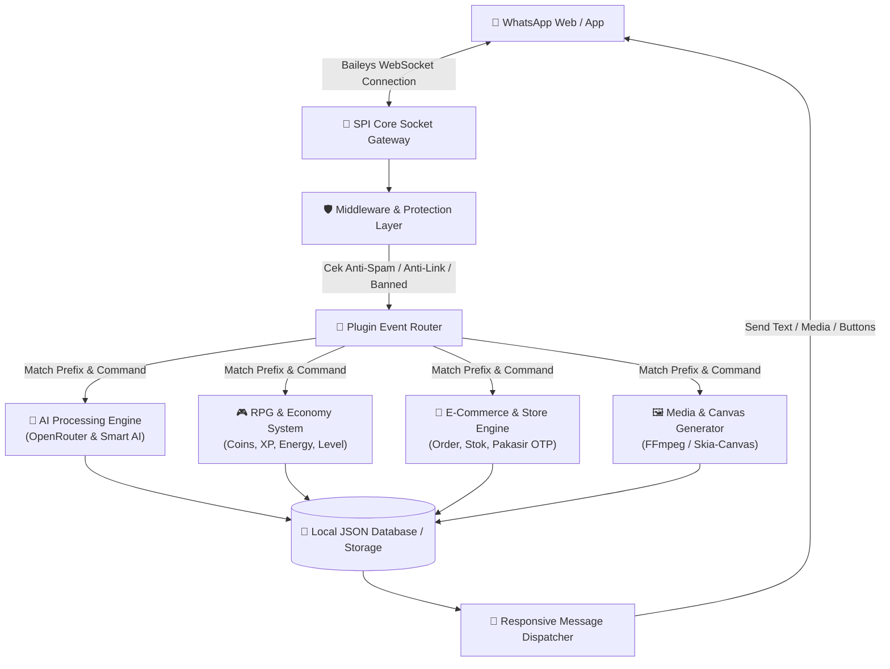

<div align="center">

  <!-- HERO BANNER / IMAGE -->
  

  <br />

  <!-- DYNAMIC TYPING SVG -->
  <a href="https://github.com/MuhammadLutfiMuzakiiVY/SYSTEM-SERVICE-SPI">
    
  </a>

  <p align="center">
    <strong>Arsitektur Bot WhatsApp Multi-Device Generasi Terbaru Berbasis Node.js (ESM), Sistem Plugin Modular, Integrasi Multi-AI, dan Ekosistem RPG/Store Digital.</strong>
  </p>

  <!-- SHIELDS BADGES WALL -->
  <p align="center">
    <a href="https://nodejs.org/"></a>
    <a href="https://github.com/MuhammadLutfiMuzakiiVY/SYSTEM-SERVICE-SPI"></a>
    <a href="https://github.com/MuhammadLutfiMuzakiiVY/SYSTEM-SERVICE-SPI"></a>
    <a href="https://docker.com"></a>
    <a href="LICENSE"></a>
  </p>

  <p align="center">
    <a href="#-fitur-utama--arsitektur-sistem">⚡ Fitur Utama</a> •
    <a href="#-diagram-arsitektur">📐 Arsitektur</a> •
    <a href="#-panduan-instalasi">🚀 Instalasi</a> •
    <a href="#-konfigurasi-configjs">⚙️ Konfigurasi</a> •
    <a href="#-pengembangan-plugin">🧩 Developer Guide</a> •
    <a href="#-kontributor--kredits">👤 Pengembang</a>
  </p>

</div>

---

## 📖 Ringkasan Proyek

**SYSTEM SERVICE SPI (v2.4.0)** adalah platform dan engine otomatisasi WhatsApp Multi-Device yang dibangun menggunakan **Node.js (EcmaScript Module / ESM)** dan pustaka WhatsApp socket teroptimasi. Didesain untuk keandalan tinggi, performa cepat, serta skalabilitas tinggi baik untuk penggunaan pribadi, komunitas grup, maupun kebutuhan bisnis komersial.

> [!TIP]
> **SPI Engine** menggunakan arsitektur **Modular Plugin-based Event Dispatcher**, memudahkan penambahan fitur baru tanpa perlu mengubah struktur kode inti (core runtime).

---

## 📐 Diagram Arsitektur

Berikut adalah gambaran aliran eksekusi pesan dan pemrosesan event pada **SYSTEM SERVICE SPI**:



---

## ⚡ Fitur Utama & Kapabilitas Sistem

| Kategori | Fitur & Deskripsi |
| :--- | :--- |
| **🧠 Multi-AI Integration** | Terhubung langsung dengan OpenRouter AI (Llama 3.3, DeepSeek, Qwen) dan Smart Vision Assistants. |
| **🧩 Modular Plugin System** | Setiap perintah dipisahkan ke dalam folder `plugins/` (ESM format). Mendukung *hot-reloading* tanpa perlu merestart bot. |
| **🤖 Manager JadiBot (Multi-Session)** | Memungkinkan bot utama membuat bot turunan (*clone bot*) baru melalui sistem pairing code mandiri. |
| **🛡️ Keamanan & Anti-Spam Group** | Fitur Anti-Link, Anti-Toxic, Anti-Foreign Number, Anti-Bot, Anti-Delete, serta manajemen peran Admin & Owner otomatis. |
| **🎮 RPG & Economy Engine** | Ekosistem game interaktif: Leveling system, Koin, Energi, Klaim Harian, Kuis, Tebak Gambar, Ular Tangga, dan Sistem Bank. |
| **🛒 Otomatisasi Store & TopUp** | Manajemen produk digital, auto-payment gateway (Pakasir), transaksi otomatis, stok barang, serta riwayat transaksi. |
| **🎨 Advanced Media & Canvas** | Pembuat stiker bergerak (GIF/Video via FFmpeg), Brat Canvas generator, Logo Maker, Card Welcome/Goodbye, dan OCR. |
| **☁️ Multi-Platform Deployment** | Kompatibel penuh dengan Linux VPS, Docker Container, Termux Android, dan Panel Pterodactyl. |

---

## ⚙️ Persyaratan Sistem

| Komponen | Spesifikasi Minimal | Rekomendasi |
| :--- | :--- | :--- |
| **Node.js Runtime** | `v22.0.0` | `v24.x LTS` (EcmaScript Module Support) |
| **NPM Package Manager** | `v10.0.0+` | `v10.x+` |
| **Media Converter** | FFmpeg 4.x / 5.x | FFmpeg 6.x (Terpasang pada System PATH) |
| **Memori (RAM)** | 512 MB RAM | 1 GB - 2 GB RAM |
| **Sistem Operasi** | Ubuntu 20.04+ / Debian 11+ / Windows 10+ / Android Termux | Ubuntu 22.04 LTS Server / Docker Container |

---

## 🚀 Panduan Instalasi

### 1. Cloning Repositori
Buka terminal pada komputer atau server Anda dan jalankan perintah berikut:

```bash
git clone https://github.com/MuhammadLutfiMuzakiiVY/SYSTEM-SERVICE-SPI.git
cd SYSTEM-SERVICE-SPI
```

---

### 2. Instalasi Dependensi Node.js
Pasang pustaka modul yang dibutuhkan:

```bash
npm install
```

---

### 3. Pengaturan Konfigurasi (`config.js`)
Edit file `config.js` untuk mengonfigurasi nomor WhatsApp Anda sebagai owner dan bot pairing:

```javascript
    owner: {
        name: 'Muhammad Lutfi Muzaki',   // Nama Pemilik Bot
        number: ['6282362181059']        // Nomor Owner (Format 628xxx)
    },
    session: {
        pairingNumber: '6282362181059',  // Nomor WhatsApp Bot
        usePairingCode: true             // true = Gunakan Kode Pairing
    },
    bot: {
        name: '𝗦𝗜 𝗣𝗔𝗟𝗜𝗡𝗚 𝗜𝗡𝗙𝗢𝗥𝗠𝗔𝗦𝗜 (𝗦𝗣𝗜)',
        version: '2.4.0',
        developer: 'Muhammad Lutfi Muzaki'
    }
```

---

### 4. Menjalankan Server Engine SPI
Jalankan perintah berikut untuk mengaktifkan bot:

```bash
# Modus Produksi
npm start

# Modus Pengembangan (Auto-Restart via Nodemon)
npm run dev
```

Saat pertama kali berjalan, sistem akan memberikan **Kode Pairing 8 Digit** di terminal. Masukkan kode tersebut pada aplikasi WhatsApp Anda:
> `WhatsApp -> Perangkat Tertaut -> Tautkan dengan Nomor Telepon`

---

### 🐳 Deploy Menggunakan Docker (Opsional)

Untuk kemudahan deployment di VPS server tanpa menginstall Node.js secara manual:

```bash
# Build Docker Image
docker build -t system-service-spi .

# Jalankan Container
docker run -d --name spi-bot-instance --restart always system-service-spi
```

---

### 🐧 Deploy di Android Termux (Opsional)

Untuk pengguna Android yang menjalankan bot lewat Termux:

```bash
pkg update && pkg upgrade -y
pkg install git nodejs-lts ffmpeg -y
git clone https://github.com/MuhammadLutfiMuzakiiVY/SYSTEM-SERVICE-SPI.git
cd SYSTEM-SERVICE-SPI
bash install.sh
npm start
```

---

## 🧩 Panduan Pengembangan Plugin (Developer Guide)

Setiap fitur pada **SYSTEM SERVICE SPI** menggunakan arsitektur Plugin ESM. Anda dapat membuat file baru di dalam folder `plugins/` dengan struktur seperti berikut:

```javascript
// Contoh: plugins/example/halo.js

const pluginConfig = {
    name: 'halo',
    alias: ['hi', 'hello'],
    category: 'general',
    description: 'Menyapa pengguna secara ramah',
    usage: '.halo',
    example: '.halo',
    isOwner: false,
    isGroup: false,
    cooldown: 5,
    energi: 1
}

async function handler(m, { sock }) {
    await m.reply(`Halo *${m.pushName}*! 👋 Selamat datang di SYSTEM SERVICE SPI.`)
}

export { handler, pluginConfig }
```

---

## 📂 Struktur Direktori Proyek

```
SYSTEM-SERVICE-SPI/
├── assets/                  # Aset gambar, video, dan media bot
│   ├── images/              # Gambar banner, profile, dan thumbnail (spi.jpg, spi2.jpg)
│   └── video/               # Media video pendukung (spi.mp4)
├── database/                # Penyimpanan JSON lokal & statistik
├── plugins/                 # Folder Plugin Modular
│   ├── ai/                  # Plugin Integrasi AI (Gemini, Groq, OpenRouter)
│   ├── download/            # Plugin Downloader (TikTok, YouTube, IG, Spotify)
│   ├── fun/                 # Plugin Hiburan & Game
│   ├── group/               # Plugin Moderasi & Keamanan Grup
│   ├── main/                # Plugin Utama (Menu, Help, Info)
│   ├── owner/               # Plugin Khusus Owner Bot
│   ├── store/               # Plugin E-Commerce & Otomatisasi Produk
│   └── tools/               # Plugin Utility & Converter
├── src/                     # Core Library Engine SPI
│   ├── lib/                 # Core Helper System (spi-socket.js, spi-database.js, dll)
│   ├── scraper/             # Web Scrapers & API Integrations
│   ├── connection.js        # Konfigurasi Koneksi WebSocket
│   └── handler.js           # Event Handler & Dispatcher Utama
├── config.js                # File Konfigurasi Utama Bot
├── Dockerfile               # Konfigurasi Container Docker
├── index.js                 # Entry Point Aplikasi
├── package.json             # Manifest Dependensi & Scripts
└── README.md                # Dokumentasi Resmi Proyek
```

---

## 🤝 Kontribusi & Lisensi

Proyek ini bersifat **Open Source** di bawah lisensi [MIT License](LICENSE).

Jika Anda ingin berpatisipasi mengembangkan fitur atau memperbaiki kendala (bug):
1. **Fork** repositori ini.
2. Buat branch fitur baru (`git checkout -b fitur-baru`).
3. Lakukan **Commit** perubahan Anda (`git commit -m "Tambah fitur X"`).
4. Kirim **Pull Request (PR)**.

---

<div align="center">

  

  <h3>👨‍💻 Developed & Maintained by</h3>
  <p><strong><a href="https://github.com/MuhammadLutfiMuzakiiVY">Muhammad Lutfi Muzaki</a></strong></p>

  <p>
    <a href="https://github.com/MuhammadLutfiMuzakiiVY"></a>
    <a href="mailto:muhammadlutfimuzaki2@gmail.com"></a>
    <a href="https://linkedin.com/in/muhammad-lutfi-muzaki-a55373263"></a>
  </p>

  <p><i>⭐ Jangan lupa memberikan Star pada repositori ini jika bermanfaat!</i></p>

</div>
